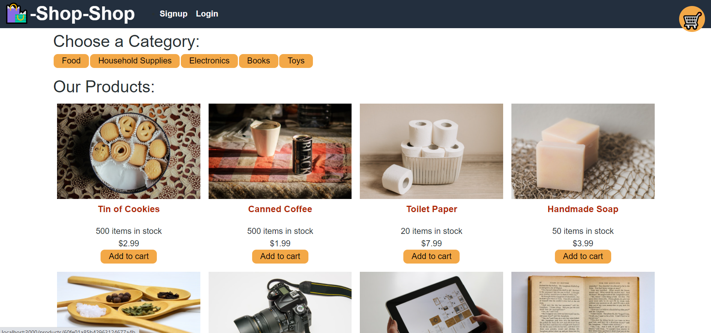

# shop-shop-redux

# Project 
Shop-Shop is a refactore e-commerce platform using Redux. App allows user to browse and filter products offer by Shop-Shop. If the user find something they would like to buy they have a ability to add it to their cart. Items in the cart can also be removed or change quantities if the user chooses to. Once user is ready to checkout, they can log into their account to checkout via Stripe.

## Build With 
* React.js
* Node.js
* Express.js
* MongoDB
* Apollo Server
* CSS
* Bootstrap
* JavaScript

## App

## By
Chaitali Patel
